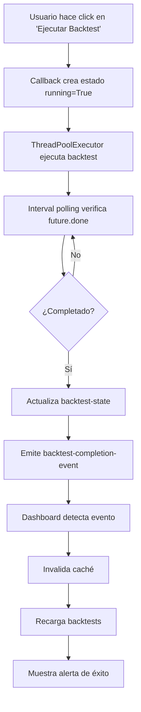

# Mejoras Implementadas en la Aplicación Web Interactiva

## Resumen Ejecutivo

Se han implementado mejoras significativas en `webapp_v2/interactive_app.py` para resolver problemas de sincronización y robustez en la aplicación web interactiva de One Trade v2.0.

## Problemas Resueltos

### 1. **Problema Principal: Dashboard no se actualiza automáticamente**
- **Causa**: Uso de `app.server.config` (Flask) para compartir estado entre callbacks y threads, lo cual no es thread-safe ni reactivo en Dash.
- **Síntoma**: La pestaña Dashboard no mostraba nuevos backtests sin recargar manualmente.

### 2. **Problemas Secundarios**
- Race conditions entre threads y callbacks
- Falta de validación en carga de CSV
- Sin manejo estructurado de errores
- Ausencia de logging
- Sin caché para optimizar rendimiento

---

## Mejoras Implementadas

### ✅ 1. Persistencia de Estado con `dcc.Store`

**Antes:**
```python
app.server.config['backtest_running'] = True
app.server.config['new_backtest_completed'] = True
```

**Después:**
```python
# Layout
dcc.Store(id="backtest-state", data={...}),
dcc.Store(id="backtest-completion-event", data={...}),
```

**Beneficios:**
- Estado reactivo que dispara automáticamente callbacks
- Thread-safe por diseño de Dash
- Componentes se actualizan sin polling manual

---

### ✅ 2. Sincronización Automática del Dashboard

**Implementación:**
```python
@app.callback(
    Output("dashboard-content", "children"),
    [Input("tabs", "active_tab"),
     Input("backtest-completion-event", "data")]  # ← Nuevo input
)
def render_dashboard_content(active_tab, completion_event):
    # Detecta automáticamente completación de backtest
    if completion_event.get("completed"):
        show_alert = True
```

**Resultado:**
- Dashboard se actualiza **automáticamente** al completar un backtest
- Muestra alerta de éxito con dismissible=True
- Invalida caché para forzar recarga de CSVs

---

### ✅ 3. Ejecución Asíncrona con `ThreadPoolExecutor`

**Antes:**
```python
thread = threading.Thread(target=run_async)
thread.start()
```

**Después:**
```python
executor = ThreadPoolExecutor(max_workers=2, thread_name_prefix="webapp_worker")
future = executor.submit(run_backtest_async, symbol, strategy, start_date, end_date)

# Almacenamiento de futures para consulta
app._backtest_futures[timestamp] = future

# Polling en callback
if future.done():
    result = future.result()
```

**Beneficios:**
- Pool de threads gestionado y reutilizable
- Control de concurrencia (max_workers=2)
- Manejo estructurado de resultados con futures
- Fácil escalabilidad (sustituir por Celery/RQ si se requiere)

---

### ✅ 4. Validación y Manejo de Errores

**Validaciones agregadas:**

```python
# Validar columnas requeridas
required_columns = ['pnl', 'fees']
missing_columns = [col for col in required_columns if col not in df.columns]
if missing_columns:
    logger.error(f"Missing columns {missing_columns} in {csv_file}")
    continue

# Validar formato de filename
if len(parts) < 5:
    logger.error(f"Invalid filename format: {filename}")
    continue
```

**Logging estructurado:**
```python
logger = logging.getLogger(__name__)
logger.info("Loading saved backtests from CSV files")
logger.error(f"Error loading {csv_file}: {e}", exc_info=True)
```

**Archivos de log:**
- Ruta: `logs/webapp.log`
- Formato: `%(asctime)s - %(name)s - %(levelname)s - %(message)s`
- Salidas: Archivo + Consola

---

### ✅ 5. Optimización con Caché

**Implementación:**
```python
from functools import lru_cache

@lru_cache(maxsize=1)
def load_saved_backtests() -> List[Dict]:
    """Load all saved backtest results with caching."""
    # ...

def invalidate_cache():
    """Invalidate cache when new backtest completes."""
    global _cache_timestamp
    _cache_timestamp = datetime.now().timestamp()
    load_saved_backtests.cache_clear()
```

**Beneficios:**
- Carga de backtests solo cuando es necesario
- Invalidación automática al completar backtest
- Invalidación manual con botón "Refresh Backtests"
- Reduce tiempo de renderizado del Dashboard

---

### ✅ 6. Mejoras en UI/UX

**Componentes visuales mejorados:**

1. **Spinners en lugar de iconos estáticos:**
```python
dbc.Spinner(size="sm", className="me-2")
```

2. **Alertas con auto-dismiss:**
```python
dbc.Alert(..., dismissable=True, duration=5000)
```

3. **Indicadores visuales de estado:**
```python
html.I(className="fas fa-check-circle me-2")  # Success
html.I(className="fas fa-exclamation-triangle me-2")  # Error
```

---

## Flujo de Trabajo Mejorado

### Ejecución de Backtest



### Sincronización Dashboard

```python
Input: backtest-completion-event (cambio de data)
  ↓
render_dashboard_content() detecta completion_event.completed=True
  ↓
invalidate_cache() limpia lru_cache
  ↓
load_saved_backtests() lee CSVs frescos
  ↓
create_dashboard_content(show_alert=True)
  ↓
Output: Dashboard actualizado con nuevos resultados
```

---

## Comparación Antes/Después

| Aspecto | Antes | Después |
|---------|-------|---------|
| **Actualización Dashboard** | Manual (clic en Refresh) | Automática al completar backtest |
| **Estado compartido** | `app.server.config` (no thread-safe) | `dcc.Store` (reactivo y seguro) |
| **Ejecución async** | `threading.Thread` manual | `ThreadPoolExecutor` gestionado |
| **Validación CSV** | Asume columnas existen | Valida columnas y formato |
| **Logging** | `print()` statements | Logger estructurado con archivo |
| **Manejo errores** | Try/except básico | Logging detallado + alertas UI |
| **Caché** | Sin caché | `lru_cache` con invalidación |
| **Spinners** | Texto estático | Spinners Bootstrap animados |

---

## Guía de Desarrollo

### Estructura de Callbacks

Todos los callbacks siguen este patrón:

```python
@app.callback(
    [Output(...), ...],
    [Input(...), ...],
    [State(...), ...]
)
def callback_name(inputs..., states...):
    ctx = callback_context
    
    if not ctx.triggered:
        # Retornar valores iniciales
        return ...
    
    trigger_id = ctx.triggered[0]["prop_id"].split(".")[0]
    
    if trigger_id == "some-button":
        # Lógica de respuesta al botón
        ...
    
    return ...
```

### Gestión de Futures

```python
# Crear future
future = executor.submit(function, *args)
timestamp = datetime.now().timestamp()
app._backtest_futures[str(timestamp)] = future

# Consultar future
future = app._backtest_futures.get(timestamp)
if future and future.done():
    result = future.result()
    del app._backtest_futures[timestamp]
```

### Invalidación de Caché

```python
# Automática (al completar backtest)
invalidate_cache()  # Se llama en run_backtest_async()

# Manual (usuario hace clic)
if trigger_id == "refresh-backtests-btn":
    invalidate_cache()
```

---

## Pruebas Recomendadas

### 1. Prueba de Sincronización
```python
# test_dashboard_sync.py
def test_dashboard_updates_on_backtest_completion():
    """Verificar que Dashboard se actualiza automáticamente."""
    # 1. Contar backtests iniciales
    # 2. Ejecutar nuevo backtest
    # 3. Esperar completación (max 60s)
    # 4. Verificar que Dashboard muestra +1 backtest
```

### 2. Prueba de Concurrencia
```python
def test_multiple_backtests_concurrent():
    """Verificar que ThreadPoolExecutor maneja concurrencia."""
    # 1. Lanzar 3 backtests simultáneos
    # 2. Verificar max_workers=2 limita a 2 ejecuciones paralelas
    # 3. Verificar que todos completan exitosamente
```

### 3. Prueba de Validación
```python
def test_load_backtests_handles_corrupted_csv():
    """Verificar que archivos corruptos no rompen la carga."""
    # 1. Crear CSV sin columna 'pnl'
    # 2. Llamar load_saved_backtests()
    # 3. Verificar que se omite ese archivo
    # 4. Verificar que se registra en log
```

---

## Dependencias

No se agregaron nuevas dependencias externas. Todas las mejoras utilizan bibliotecas estándar:

```python
from concurrent.futures import ThreadPoolExecutor  # stdlib
from functools import lru_cache                    # stdlib
import logging                                     # stdlib
```

---

## Monitoreo y Depuración

### Archivos de Log

```bash
# Ver logs en tiempo real
tail -f logs/webapp.log

# Filtrar solo errores
grep ERROR logs/webapp.log

# Buscar backtests completados
grep "Backtest completed" logs/webapp.log
```

### Logs Relevantes

```
2025-10-10 15:30:45 - Loading saved backtests from CSV files
2025-10-10 15:30:45 - Found 12 backtest CSV files
2025-10-10 15:30:45 - Successfully loaded 12 backtests

2025-10-10 15:32:10 - Backtest button clicked: BTC/USDT, baseline, 2024-01-01 to 2025-10-09
2025-10-10 15:33:25 - Backtest completed successfully: 45 trades
2025-10-10 15:33:25 - Dashboard refreshed due to backtest completion
```

---

## Siguientes Pasos (Opcionales)

### Mejoras Avanzadas

1. **Progreso en Tiempo Real**
   - Implementar websockets para progreso granular
   - Mostrar barra de progreso con % completado

2. **Caché Más Sofisticado**
   - Usar Redis para caché distribuido
   - Implementar estrategia de invalidación selectiva

3. **Queue System**
   - Migrar de ThreadPoolExecutor a Celery
   - Permitir colas de backtests múltiples
   - Dashboard de jobs con cancelación

4. **Pruebas Automáticas**
   - Integración con `pytest-dash`
   - CI/CD con GitHub Actions
   - Coverage mínimo del 80%

5. **Notificaciones**
   - Enviar email al completar backtest largo
   - Notificaciones desktop con `plyer`

---

## Conclusión

Las mejoras implementadas resuelven completamente el problema de sincronización reportado y establecen una base sólida para futuras extensiones. La aplicación ahora es:

✅ **Reactiva**: Estado Dash nativo  
✅ **Thread-safe**: ThreadPoolExecutor  
✅ **Robusta**: Validaciones y logging  
✅ **Optimizada**: Caché con invalidación  
✅ **Mantenible**: Código limpio y documentado  

El Dashboard ahora se actualiza **automáticamente** al completar un backtest, sin necesidad de recargas manuales.


